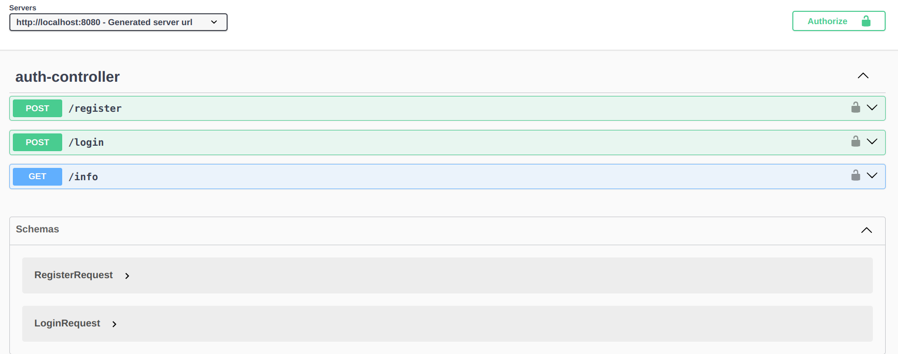
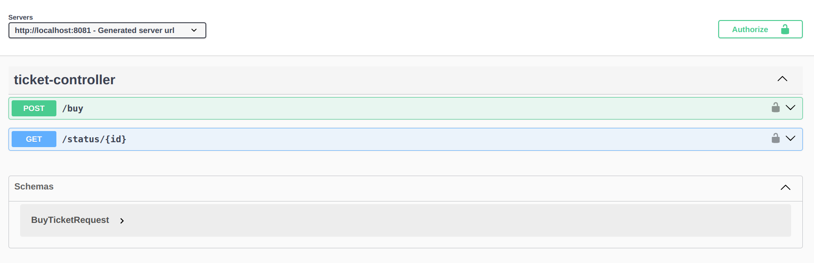
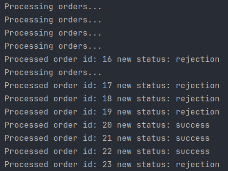

# Система заказов по покупку билетов

# Дамм Денис БПИ228

## Запуск проекта

В корне приложения

```docker
docker-compose -up [d]
```

## Cтруктура проекта

```zsh
├── auth
│   └── AuthApp
│       ├── Dockerfile
│       └── src
│           ├── main
│              ├── java
│                 └── auth
│                     ├── configs                               # конфиги
│                     ├── controllers                           # контроллеры
│                     ├── dtos                                  # dto для запросов и ответов с сервера
│                     │   ├── requests
│                     │   ├── responses
│                     │   └── utils
│                     ├── models                                # доменные сущности 
│                     ├── repository                            # репозитории для доменных сущностей
│                     └── services                              # бизнес-сервисы - определенные абстракции,
│                         ├── abstractions                      # result-ответы от бизнеса
│                         ├── results                           # реализации абстракций
|                         ├── AuthServiceImpl.java
│                         └── SecurityServiceImpl.java
├── booking
│   └── Booking
│       └── src
│           ├── main
│              └── booking
│                     ├── background                            # background-рабочие (фоновые потоки)
│                     ├── configs                               # конфиги
│                     ├── controllers                           # контроллеры
│                     ├── dtos                                  # dto - запросы и ответы с сервера
│                     │   ├── requests
│                     │   └── responses
│                     ├── models                                # доменные сущности
│                     ├── repositories                          # репозитории с доменными сущностями
│                     ├── security                              # модуль безопасности
│                     └── services                              # бизнес-сервисы
│                         ├── abstractions                      # абстракции для сервисов
│                         └── results                           # бизнес-ответы с сервера
|
├── docker-compose.yaml
├── init.sql
└── readme.md
```

## AuthService



## BookingService



### BackgroundJob



Считает бачами и обрабатывает заказы
